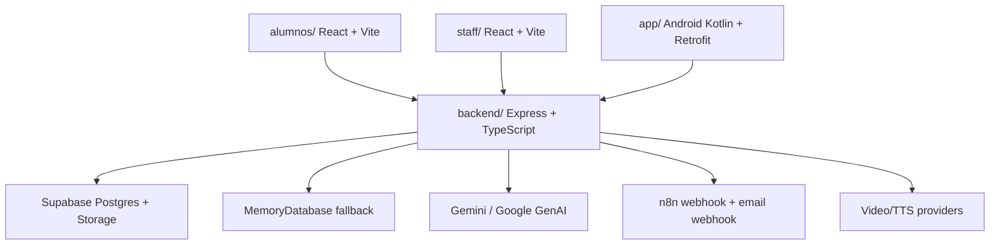

# Arquitectura del Sistema

Este documento describe la arquitectura vigente del repositorio, no la primera versión histórica del proyecto.

## Vista general

## Componentes principales

### `backend/`

Archivo de arranque: [`backend/src/server.ts`](file:///c:/Users/angel/Desktop/academicFinace/backend/src/server.ts)

Responsabilidades:

- CORS, rate limiting y headers de seguridad.
- JSON logging estructurado.
- Rutas de autenticación, cursos, progreso, ejercicios, pipeline y simulador.
- Health checks y diagnóstico de cola de correos.
- Worker de reintento para correo vía n8n.

Rutas montadas:

- `/api/auth`
- `/api/courses`
- `/api/progress`
- `/api/exercises`
- `/api/pipeline`
- `/api/webhooks`
- `/api/simulator`

### `alumnos/`

Portal de estudiantes en React/Vite.

Responsabilidades:

- autenticación de perfiles `student`,
- navegación a cursos y clips,
- reproducción y seguimiento de progreso,
- ejercicios y utilidades académicas,
- registro público y manejo de PWA.

### `staff/`

Portal web de instructores y administradores en React/Vite.

Responsabilidades:

- autenticación de perfiles `instructor` y `admin`,
- panel docente para cursos, clips, preguntas y pipeline,
- panel admin para directorio de cuentas, solicitudes y usuarios,
- actualización PWA y pre-warm del backend.

### `app/`

App Android nativa para administración.

Responsabilidades:

- login admin,
- OTP,
- aprobación/rechazo de solicitudes,
- polling periódico de solicitudes pendientes.

## Autenticación y autorización

### JWT HS256

[`backend/src/middleware/auth.ts`](file:///c:/Users/angel/Desktop/academicFinace/backend/src/middleware/auth.ts) valida tokens firmados con `SUPABASE_JWT_SECRET`. El backend extrae:

- `sub` como `req.user.id`,
- `email`,
- `user_metadata.role`.

### Sandbox local

Si `ENABLE_DOCKER_MOCKS` está activo y no se exige auth real, el backend puede inyectar un usuario simulado mediante cabeceras como:

- `x-mock-user-id`
- `x-view-mode`

Esto permite probar portales y rutas sin Supabase real.

### RBAC

- `student` solo debe entrar al portal de alumnos.
- `instructor` y `admin` solo deben entrar al portal de staff.
- Android actualmente está orientada a `admin`.

## Persistencia dual

### Supabase real

Se usa cuando `isSupabaseReady()` confirma credenciales válidas. El backend opera sobre:

- tablas SQL,
- Storage para imágenes y videos,
- cola persistente de correos si existe la tabla `email_queue`.

### Fallback local

[`backend/src/lib/memoryDb.ts`](file:///c:/Users/angel/Desktop/academicFinace/backend/src/lib/memoryDb.ts) modela perfiles, cursos, clips, ejercicios, progreso, preguntas, solicitudes y pipeline para desarrollo local.

Regla de mantenimiento: cuando una ruta soporta ambos mundos, ambos caminos deben mantenerse coherentes.

## Integraciones externas

### IA

[`backend/src/providers/ai.ts`](file:///c:/Users/angel/Desktop/academicFinace/backend/src/providers/ai.ts)

- fast-pass determinista,
- fallback mock,
- evaluación con Gemini para ejercicios abiertos.

### Correo

[`backend/src/providers/email.ts`](file:///c:/Users/angel/Desktop/academicFinace/backend/src/providers/email.ts)

- envía al webhook de n8n cuando está configurado,
- si n8n no responde, encola el correo,
- la cola se reintenta desde [`backend/src/lib/emailQueue.ts`](file:///c:/Users/angel/Desktop/academicFinace/backend/src/lib/emailQueue.ts).

### Video e imágenes

[`backend/src/routes/courses.ts`](file:///c:/Users/angel/Desktop/academicFinace/backend/src/routes/courses.ts)

- subida de imágenes en base64 a Supabase Storage,
- subida de videos con `multer`,
- optimización local con `ffmpeg-static`,
- publicación a Storage cuando Supabase está activo.

### Webhooks n8n

[`backend/src/webhooks/n8n.ts`](file:///c:/Users/angel/Desktop/academicFinace/backend/src/webhooks/n8n.ts)

- conserva `rawBody`,
- valida HMAC con `x-n8n-signature`,
- protege contra replay simple con `processedPipelines`,
- hoy simula creación/actualización de clips; no es todavía un pipeline end-to-end persistente completo.

## Flujos funcionales más importantes

### Alta y acceso de cuentas

1. Usuario envía `register-request`.
2. Admin aprueba o rechaza.
3. Se genera contraseña temporal.
4. El usuario inicia sesión.
5. Si aplica, debe cambiar contraseña.
6. Si OTP está habilitado, valida código por correo.

### Aprendizaje

1. Alumno carga cursos visibles.
2. Entra a curso y clips aprobados.
3. Reporta progreso.
4. Resuelve ejercicios.
5. Backend actualiza intentos y puntos.

### Operación docente

1. Instructor administra cursos y clips.
2. Puede subir imagen/video.
3. Revisa pipeline drafts.
4. Responde preguntas de alumnos.

### Operación administrativa

1. Admin gestiona `allowed_emails`.
2. Admin aprueba solicitudes y recuperaciones.
3. Admin puede cambiar roles y KYC.
4. La app Android replica el flujo de solicitudes.
